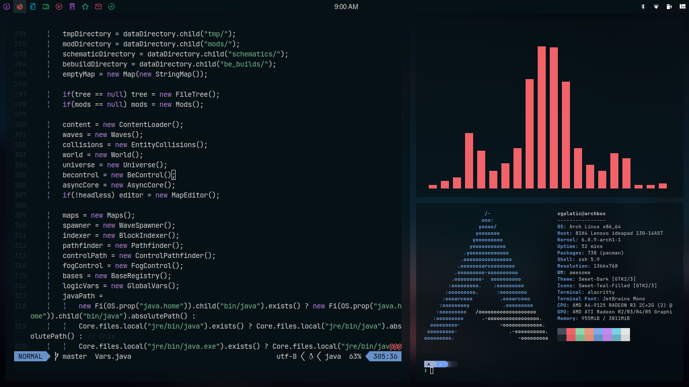

# My personal dot files

## **Thanks for dropping by!**

Here are some details about my setup:

 - **WM**: [AwesomeWM](https://github.com/awesomeWM/awesome/)
 - **OS**: Arch Linux
 - **Shell**: [Starship](https://starship.rs/)
 - **Terminal**: [Alacritty](https://github.com/alacritty/alacritty)
 - **Editor**: [Neovim](https://neovim.io)
 - **Lock Screen**: [i3lock-fancy](https://github.com/meskarune/i3lock-fancy)
 - **File  Manager**: [PCManFM](https://github.com/lxde/pcmanfm)
 - **Launcher**: [rofi](https://github.com/davatorium/rofi/)
 - **Browser**: Firefox
# Installing
```shell
# Clone the repository
$ git clone https://github.com/rhmvl/dotfiles
$ cd dotfiles
$ sudo chmod +x ./install
$ ./install
```

One liner
```shell
$ git clone https://github.com/rhmvl/dotfiles && cd dotfiles && sudo chmod +x ./install && ./install
```

# Keybinds
|Keybin|Action|
|------|------|
|`Super + Enter`|Spawn terminal|
|`Super + d`|Launch rofi|
|`Super + Esc`|Launch exit screen|
|`Super + q`|Close client|
|`Super + [1-0]`|View tag AKA change workspace|
|`Super + Shift + [1-0]`|Move focused client to tag|
|`Super + [arrow keys]`|Change focus by direction|
|`Super + [hjkl]`|^|
|`Super + Control + [arrow keys]`|Resize client|
|`Super + Control + [hjkl]`|^|

*...And many many more*.
