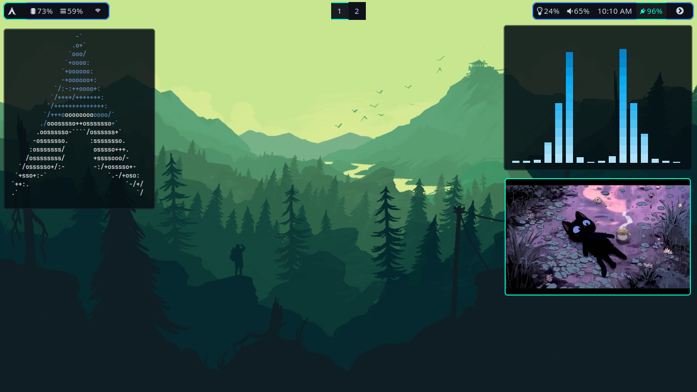
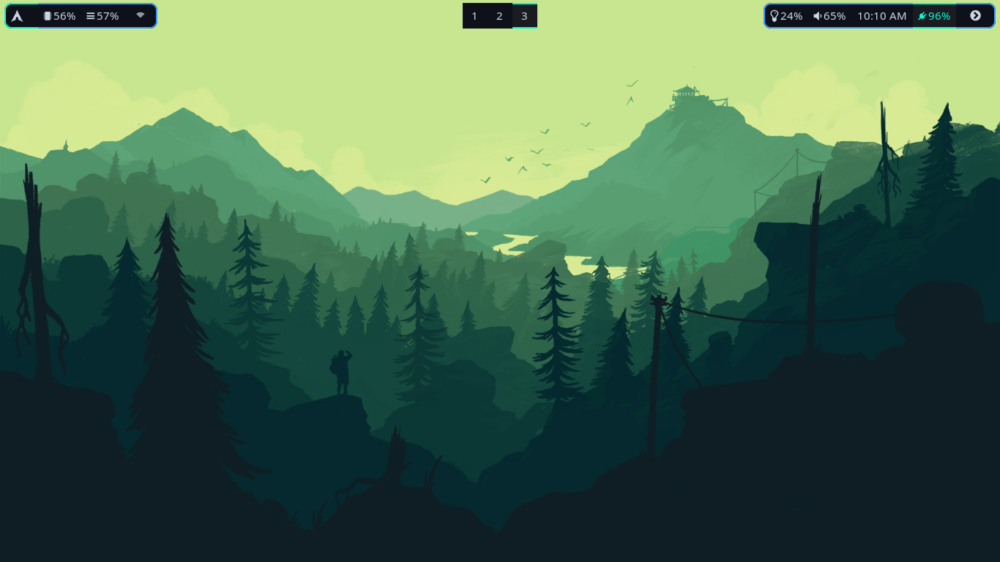

# My personal dotfiles

A minimal Hyprland configuration for Wayland. This setup focuses on speed, usability, and productivity with essential tools and thoughtful keybindings.

---

## Screenshots

---

## Dependencies

Make sure the following applications are installed:

* **[Hyprland](https://github.com/hyprwm/Hyprland)** – Wayland compositor
* **[Alacritty](https://github.com/alacritty/alacritty)** – Terminal emulator
* **[Hyprshot](https://github.com/Gustash/Hyprshot)** - Screenshot
* **[Rofi](https://github.com/davatorium/rofi)** – App launcher
* **[Hyprpaper](https://github.com/hyprwm/hyprpaper)** – Wallpaper manager
* **[Waybar](https://github.com/Alexays/Waybar)** – Status bar
* **[PCManFM](https://wiki.lxde.org/en/PCManFM)** – File manager
* **[Dunst](https://github.com/dunst-project/dunst)** – Notification daemon
* **[PulseAudio](https://www.freedesktop.org/wiki/Software/PulseAudio/)** – Audio system

Optional (but recommended):

* `playerctl` – For media key support
* `brightnessctl` – For brightness control
* `wpctl` – Part of PipeWire's `wireplumber`, used for audio volume control

---

## Keybindings

> `$mainMod = SUPER` (the Windows key)

### Core Bindings

| Keybind             | Action                           |
| ------------------- | -------------------------------- |
| `SUPER + Return`    | Launch terminal (`alacritty`)    |
| `SUPER + Q`         | Close active window              |
| `SUPER + F`         | Launch Firefox                   |
| `SUPER + E`         | Launch file manager (`pcmanfm`)  |
| `SUPER + V`         | Toggle floating mode             |
| `SUPER + B`         | Toggle Waybar                    |
| `SUPER + P`         | Launch application menu (`rofi`) |
| `SUPER + Shift + R` | Reload Hyprland config           |
| `SUPER + Shift + Q` | Exit Hyprland                    |

### Focus & Navigation

| Keybind              | Action                            |
| -------------------- | --------------------------------- |
| `SUPER + J/K`        | Move focus down/up                |
| `SUPER + H/L`        | Resize window left/right          |
| `SUPER + Arrow Keys` | Move focus in specified direction |

### Workspaces

| Keybind                 | Action                        |
| ----------------------- | ----------------------------- |
| `SUPER + [1–0]`         | Switch to workspace 1–10      |
| `SUPER + Shift + [1–0]` | Move window to workspace 1–10 |
| `SUPER + Mouse Scroll`  | Cycle workspaces up/down      |

### Special Workspaces

| Keybind             | Action                             |
| ------------------- | ---------------------------------- |
| `SUPER + S`         | Toggle special workspace (`magic`) |
| `SUPER + Shift + S` | Move window to special workspace   |

### Mouse Bindings

| Keybind               | Action           |
| --------------------- | ---------------- |
| `SUPER + Left Click`  | Drag/move window |
| `SUPER + Right Click` | Resize window    |

### Screenshot Bindings

| Keybind                    | Action               |
| -------------------------- | -------------------- |
| `SUPER + PrintScr`         | Screenshot a window  |
| `PrintScr`                 | Screenshot a monitor |
| `SUPER + SHIFT + PrintScr` | Screenshot a region  |

### Media & Hardware

| Keybind                 | Action                    |
| ----------------------- | ------------------------- |
| `XF86AudioRaiseVolume`  | Increase volume by 5%     |
| `XF86AudioLowerVolume`  | Decrease volume by 5%     |
| `XF86AudioMute`         | Toggle audio mute         |
| `XF86AudioMicMute`      | Toggle mic mute           |
| `XF86MonBrightnessUp`   | Increase brightness by 5% |
| `XF86MonBrightnessDown` | Decrease brightness by 5% |
| `XF86AudioNext`         | Next track                |
| `XF86AudioPlay/Pause`   | Play/pause media          |
| `XF86AudioPrev`         | Previous track            |

---

## Notes

* Ensure `rofi`, `wpctl`, `playerctl`, and `brightnessctl` are installed if you're using related keybinds.
* Customize `$terminal`, `$fileManager`, and `$menu` variables in your `hyprland.conf` as needed.

---
