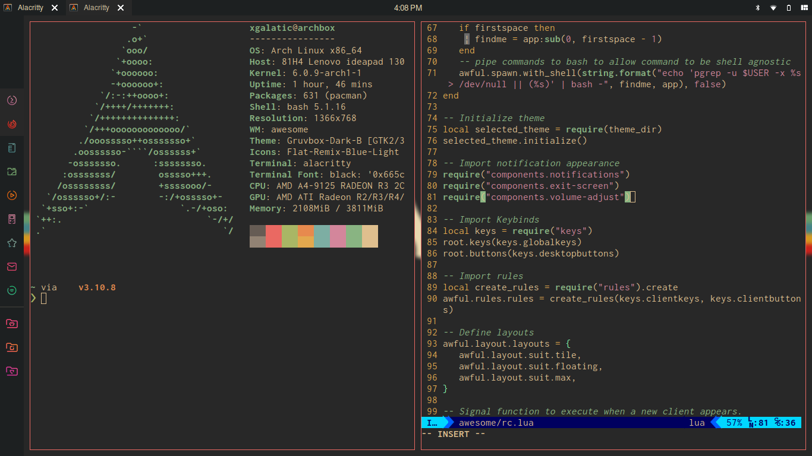

# My personal dot files

## **Table of contents**
- [My personal dot files](#my-personal-dot-files)
  - [**Table of contents**](#table-of-contents)
- [Setup](#setup)
- [AwesomeWM](#awesomewm)
  - [File Structure](#file-structure)
  - [Keybinds](#keybinds)

**Thanks for dropping by!**



Here are some details about my setup:

 - **WM**: [AwesomeWM](https://github.com/awesomeWM/awesome/)
 - **OS**: Arch Linux
 - **Shell**: [Starship](https://starship.rs//)
 - **Terminal**: [Alacritty](https://github.com/alacritty/alacritty)
 - **Editor**: [Neovim](https://neovim.io)
 - **Lock Screen**: [i3lock-fancy](https://github.com/meskarune/i3lock-fancy)
 - **File  Manager**: [PCManFM](https://github.com/lxde/pcmanfm)
 - **Launcher**: [rofi](https://github.com/davatorium/rofi/)
 - **Browser**: Firefox

# Setup
1. Install the git version of AwesomeWM.

    **Arch users** can use the [awesome-git AUR package](https://aur.archlinux.org/packages/awesome-git/).
    ```
    yay -S awesome-git
    ```
    **For other distros**, build instructions are [here](https://github.com/awesomeWM/awesome/#building-and-installation).
2. Install dependencies
    + Ubuntu 18.04 or newer (and all Ubuntu-based distributions)
        ```Shell
        sudo apt install rofi mpc feh pulseaudio alsa-utils scrot redshift i3lock-fancy
        ```
    + **Arch Linux** (and all Arch-based distributions)
        *Assuming your AUR helper is `yay`*
        ```Shell
        yay -S rofi mpd mpc feh pulseaudio alsa-utils scrot redshift i3lock-fancy-git
        ```
3. Enable services
    ``` Shell
    # For automatically launching mpd on login
    systemctl --user enable mpd.service
    systemctl --user start mpd.service
    # For charger plug/unplug events (if you have a battery)
    sudo systemctl enable acpid.service
    sudo systemctl start acpid.service
    ```
4. Install awesome config files
    ```Shell
    git clone https://github.com/xGalatic/dotfiles
    cd dotfiles
    [ -e ~/.config/awesome ] && mv ~/.config/awesome ~/.config/awesome-backup-"$(date +%Y.%m.%d-%H.%M.%S)" # Backup current configuration
    cp -r config/awesome ~/.config/awesome
    ```

# AwesomeWM
## File Structure
After setting up my AwesomeWM configuration, inside ~/.config/awesome you will find the following:

- rc.lua

    The main configuration file which binds everything together.
- keys.lua

    It initializes global and client keybinds. In addition, it defines what mouse clicks do on windows, window titlebars or the desktop.
- rules.lua

    It creates rules for the application
- `themes` directory

    Here you can find a directory for each available theme.

    Such a directory should include at least a theme.lua and optionally icons, wallpaper, and whatever asset you need that is theme-specific. The theme.lua file usually sets colors, sizes and positions of various elements.
- `components` directory
    
    Basic folder for things like Exit Screen, etc.
- `themes` directory
    
    This directory contains a themes you can use
    
    To change the theme go to `rc.lua` and change the `theme` to avaiable theme
- `wallpaper` directory
  
    This directory contains a wallpaper
- `widgets` directory
   
   Same with the `components` directory. but more specific
## Keybinds
|Keybin|Action|
|------|------|
|`Super + Enter`|Spawn terminal|
|`Super + d`|Launch rofi|
|`Super + Esc`|Launch exit screen|
|`Super + q`|Close client|
|`Super + [1-0]`|View tag AKA change workspace|
|`Super + Shift + [1-0]`|Move focused client to tag|
|`Super + [arrow keys]`|Change focus by direction|
|`Super + [hjkl]`|^|
|`Super + Control + [arrow keys]`|Resize client|
|`Super + Control + [hjkl]`|^|

*...And many many more*.